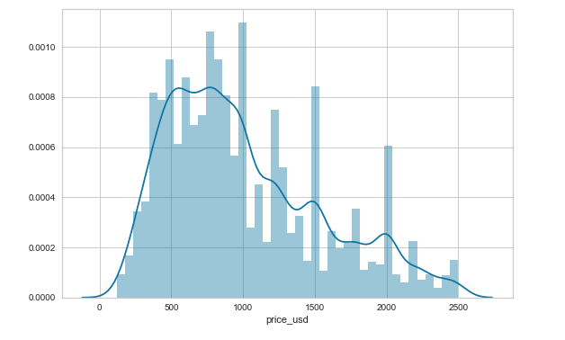
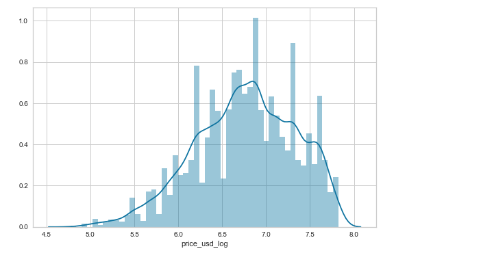
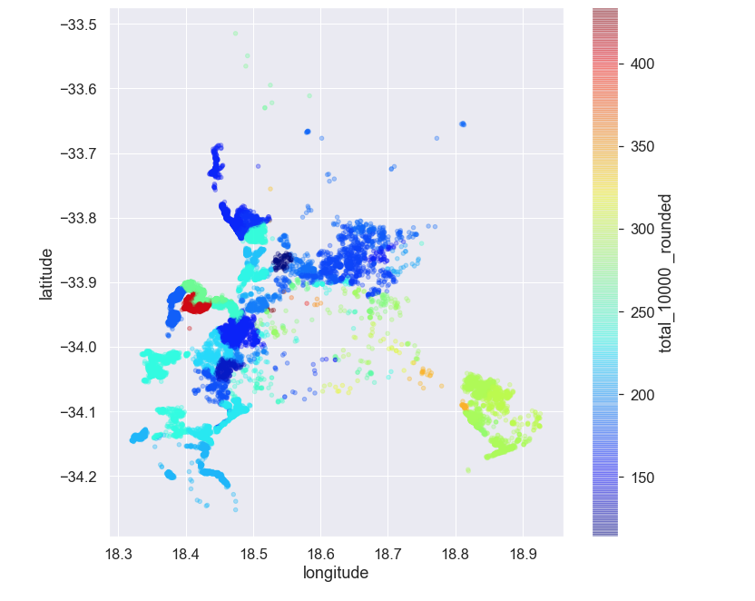
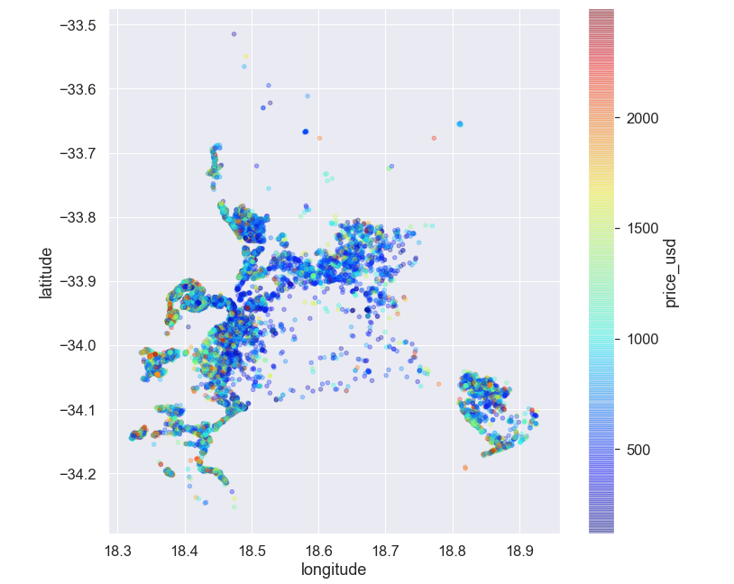
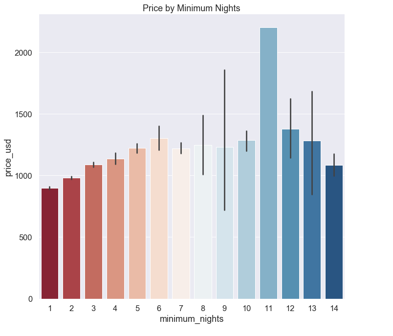
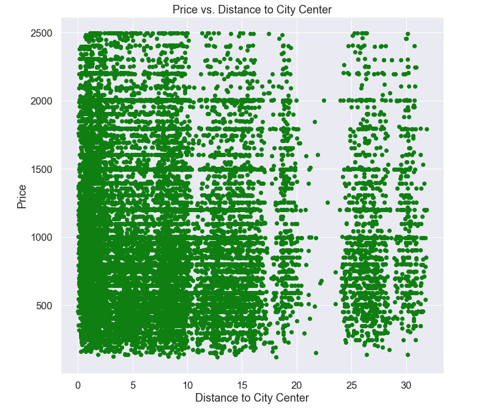
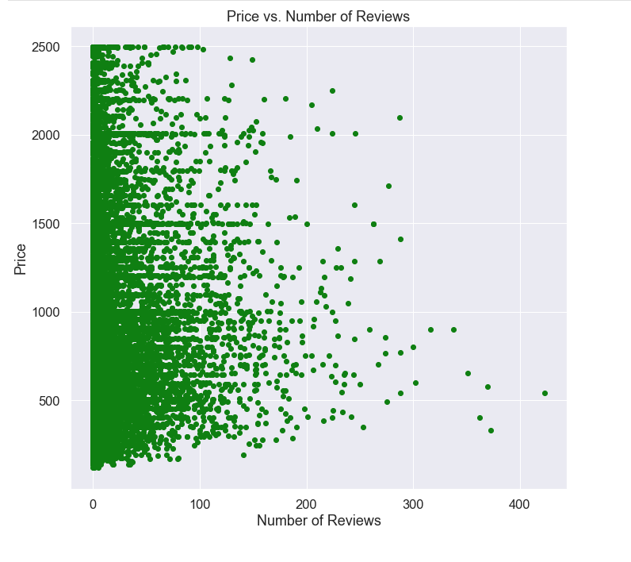

# MODULE 2 FINAL PROJECT
by Dolci Sanders

 ## Introduction

For my project, I decided to explore Air BNB prices in Cape Town, South Africa. After gathering data from Inside AirBNB (https://insideairbnb.com) as well as data from Wazimap (https://wazimap.co.za) based on available census data. I was able to download the data and manipulate it in numbers before transforming it to a .csv for integration into the AirBNB data. For this project, I hope to be able to use modeling to precict prices of AirBNB's for the Cape Town, South Africa market. By collecting this data, I hopenbe able to answer the following questions.

1. Is there a statistically significant difference in price closer to tourist attractions?
2. Does the crime rate in certain wards influence the prices of Air BNB's in the area? 
3. Does the minimum night stay have a statistical significance on the price? 
4. Can I make a model that predicts price better than the baseline? 

## File Structure

- listings.csv from Inside AirBNB 2020 (AirBNB data)
- SA_crime_ward.csv (crimes per 10,000 by ward)
- Final_Cape_Town_AirBNB.ipynb 
    - Cleans data, merges, and creates new columns based off of the received data
    - Feature engineering of new features
    - Statistical testing and Visualizations
    - Baseline Model
    - Test models with RMSE focused scoring 

## Data Collection & Data Cleaning

I browsed many data sets before landing on data provided by Inisde AirBNB. The data turned out to be challenging with less useful features than I had anticipated, and I was able to find some 2011 crime statistics data from the last census in South Africa to supplement it. 

## Data Cleaning and Feature Engineering

After cleaning the data, I started playing with different features I engineered to help predict Air BNB costs. 

   - The data set had used partially ZAR and partially USD in the price catergory, so after researching where the break down was happening, I was able to convert a portion to dollars, and found that the conversion rate for Air BNB was 14.23 ZAR/USD rather than the current conversion rate of 16.5 ZAR/USD. 
   - Some ward crime statistics were also not provided, and I was able to inpute the mean of the surrounding wards to create a best guess for the four missing wards. 
   - Referencing AirBNB I was also able to edit rather than drop data by checking the lisitngs online if a value seemed off. This helped me edit zeros as well as find errors that stemmed from the original listing such as prices of $0 or minimum night stay of 1125. 
    
    
  - Limited minimum nights to 14 nights or less as some seemed to be 30, 90, rr 365 day stays, which are not helpful to predict vacation airbnb rentals.
  - Limited price_usd to between $20 - $2500.
    

  My target for this project is price, more specifically price_usd_log. 
On the right is the price before it is made into a log function. On the right, it is still skewed, but somewhat more normally distributed. 

 

## Baseline Model

Once the data was cleaned to the point of running a baseline model, I used the DummyRegressor to create a mean and median based baseline model. The original scores for the baseline model based on median were RMSE: 548.7970187273733 r2:  -0.04000143686100621

## Statistical Tests and Visualizations fourn in Final Cape Town Air BNB

    1. Two Sample T-test
    2. ANOVA

    Crime per 10,000 People shown above shows the layout of capedown. The costal areas have between 100-300 crimes per 10,000. This affects price of the airbnb to some significance as per a Two Sample Test included in the Final_Cap

    

## Price by Minimum Nights 

This graph was not exactly what I expected, and there was large amount of expensive houses at 11 nights minimum.
I found this to be pretty odd. 

## Price by Distance to City Center 

Price vs Distance to City Center
 
Here we can se there are more AirBnbs closer (< 5 miles, and the majority prive does seem to go down a little, there aslo seems to be a distinct mark at the 1000 and 2000 dollar range as people may round their price per night)

## Price vs Number of Reviews

Many listings have under 100 revies, but those with the most reviews seem to be less costly, possibly because they are booked more frequently than the more expensive houses. 

## Final Models

    1. Poly 3 
        Testing RMSE: 519.8636117866749
        R2: .9950 (The part of the variation that is explained by my engeineered features did increase!)

    2. Lasso
        Testing RMSE:   515.0013547581824
        This ended up being the best model. 

    3. Poly 3 through Lasso
        Testing RMSE:  518.5546707977804

    4. Linear Regression
        Testing RMSE:  519.8636117866749

##Compared to baseline after cleaning: 
##RMSE 548.7970187273733 R2:  -0.04000143686100621    
##Before Data cleaning, RMSE  693.3257724308925 R2:  -0.07212491057954762

# An overall improvement of $178.33 towards accuracy using the Lasso Model.

## Conclusions 

Models in Data Science are a powerful tool that can help us predict accuracy or interpret the impact of the variance on data set. Feature engineering allows us to build features and find statistically relevent information with the help of statistics in the way of statistical testing. 

This model proved challenging to work with as the amount of features was somewhat smaller than I had hoped. In combination with crime statistics, it did seem to be enough to help bring the baseline RMSE down $178 but pushed the R2 up to .995! 
 
I would say for the accuracy of the model, I would advise more data would be needed to accurately predict the pricing of an AirBnBs in Cape Town such as bedrooms and amenities, and more time to feature engineer and run additional statistical testing. 
 
    - The crime rates in Cape Town do seem to play a major role in where AirBnBs are located. Having gaps where crime is very high. 
    - Having Entire house/apt listed rather than a shared room does effect price. 
    - Distance to city center is not necessarily a factor on price, but there are more expensive options in the city center. 
    - Number of reviews is statistically relevant to the price. 
    
Frome a business standpoint, I believe investing in predicting the price of an AirBnb is a great tool to assess real estate investments, helping local South Africans price out their home when they are looking to take a holiday.

